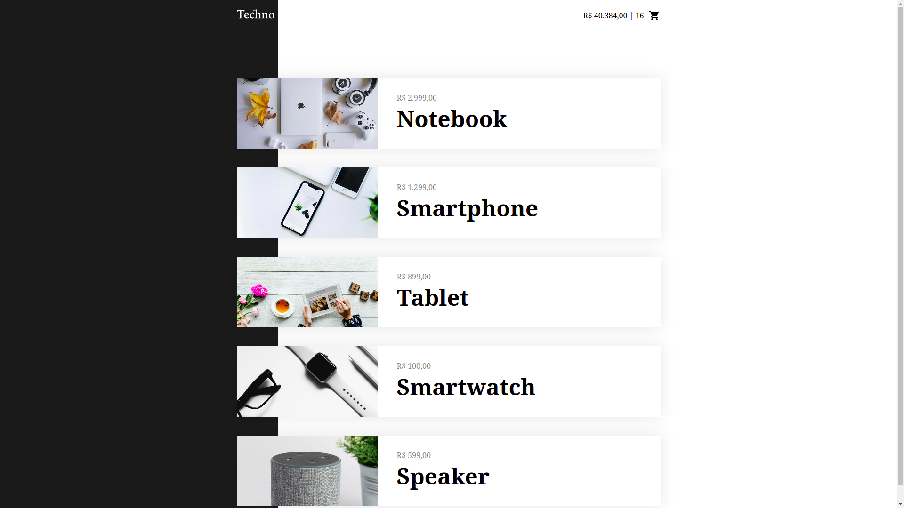

# Techno

#### This project is a website for shoping eletronics. It was made with the purpose to practice HTML, CSS and Vue Js.

&nbsp;

## Functionality
#### The user can navigate through the products, add and/or remove them from the cart. The list of products is stored at the localstorage. The products come from a fake API.

&nbsp;

## Home page

&nbsp;

### Autor
---

<a href="">
 
  
 <b>Marcelo Miranda Viana</b></a> 

Made by Marcelo Miranda Viana 👋🏽 

Get in touch!

 
